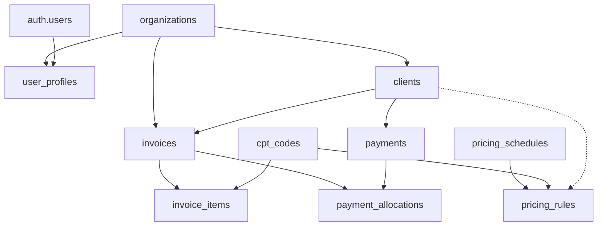

# PBS Invoicing - Supabase Database Documentation

## 📁 Folder Structure

```
supabase/
├── migrations/           # Database migrations (ordered by timestamp)
│   ├── 20250815_complete_current_schema.sql    # Complete table schema
│   ├── 20250815_rls_policies.sql              # Row Level Security policies
│   └── 20250815_functions_and_triggers.sql    # Functions, triggers, and procedures
├── functions/           # Edge functions
│   ├── import-data/    # CSV import function
│   └── send-invoice-email/  # Email sending function
├── seed.sql            # Seed data for development/testing
├── config.toml         # Supabase configuration
├── EXPORT_COMPLETE_SCHEMA.sql  # Script to export current schema
└── README.md           # This file
```

## 🗄️ Database Schema Overview

### Core Tables

#### Organizations & Users
- **organizations** - Multi-tenant organizations
- **user_profiles** - Links users to organizations
- **roles** - System roles with permissions
- **user_roles** - User-role assignments

#### Billing Entities
- **clients** - Customer organizations
- **invoices** - Invoice headers
- **invoice_items** - Line items on invoices
- **cpt_codes** - Service/product codes

#### Financial
- **payments** - Payment records
- **payment_allocations** - Links payments to invoices
- **account_credits** - Credit notes and adjustments
- **disputes** - Invoice disputes

#### Pricing
- **pricing_schedules** - Named pricing configurations
- **pricing_rules** - Specific pricing by client/CPT code

#### System
- **import_queues** - File import tracking
- **audit_logs** - Change tracking

## 🔑 Key Features

### Multi-Tenancy
- All data is isolated by `organization_id`
- Default organization: `00000000-0000-0000-0000-000000000000`
- Users can belong to multiple organizations via `user_profiles`

### Generated Columns
- `balance_due` = `total_amount - paid_amount` (auto-calculated)
- `line_total` = `quantity * unit_price` (auto-calculated)
- `remaining_amount` = `amount - used_amount` (for credits)

### Audit Trail
- Safe, non-blocking audit triggers on all major tables
- Tracks INSERT, UPDATE, DELETE operations
- Stores old/new values as JSONB

### Row Level Security (RLS)
- Currently set to OPEN for testing (all authenticated users)
- Production policies commented out in migrations
- Organization-based isolation ready to enable

## 🚀 Quick Start

### 1. Set Up Environment Variables
```bash
cp .env.example .env.local
# Edit .env.local with your Supabase credentials
```

### 2. Run Migrations
```bash
# Using Supabase CLI
supabase db push

# Or manually in SQL Editor:
# 1. Run 20250815_complete_current_schema.sql
# 2. Run 20250815_rls_policies.sql
# 3. Run 20250815_functions_and_triggers.sql
```

### 3. Seed Database
```bash
# Run seed.sql in Supabase SQL Editor
# This creates test data including:
# - 5 test clients
# - 10 CPT codes
# - 6 sample invoices
# - Pricing rules
```

## 📊 Database Relationships



## 🔧 Key Functions (RPC)

### Reporting Functions
- `get_aging_report()` - Invoice aging analysis
- `get_client_performance()` - Client metrics
- `get_top_cpt_codes()` - Most used service codes
- `get_dashboard_summary()` - Overview stats
- `get_invoices_with_details()` - Invoices with joins

### Utility Functions
- `set_user_context(user_id)` - Set session context for audit
- `has_organization_access(org_id)` - Check user permissions
- `diagnose_data_issues()` - Debug data visibility

### Invoice Calculations
- `update_invoice_totals(invoice_id)` - Recalculate totals
- `update_invoice_paid_amount(invoice_id)` - Update payment status

## 🛠️ Common Operations

### Check Database Status
```sql
SELECT * FROM diagnose_data_issues();
```

### View Current User's Organization
```sql
SELECT * FROM user_profiles WHERE user_id = auth.uid();
```

### Test RPC Functions
```sql
SELECT * FROM get_aging_report();
SELECT * FROM get_client_performance();
SELECT * FROM get_dashboard_summary();
```

### Export Complete Schema
```sql
-- Run EXPORT_COMPLETE_SCHEMA.sql to get full DDL
```

## 🔐 Security Notes

### Current State (Development)
- RLS policies are OPEN (using `true` for all checks)
- All authenticated users can access all data
- Audit logging is non-blocking

### Production Recommendations
1. Enable proper RLS policies (uncomment in migrations)
2. Implement organization-based isolation
3. Add role-based access control
4. Enable audit triggers with proper error handling
5. Rotate all keys and secrets
6. Use service role key only server-side

## 📝 Migration History

### Active Migrations
- `20250815_complete_current_schema.sql` - All tables and indexes
- `20250815_rls_policies.sql` - Security policies
- `20250815_functions_and_triggers.sql` - Business logic

### Legacy Migrations (Reference Only)
- Various numbered migrations from development
- May contain duplicate or conflicting definitions
- Keep for historical reference but don't run

## 🐛 Troubleshooting

### No Data Showing
1. Run `diagnose_data_issues()` function
2. Check user has organization profile
3. Verify RLS policies aren't blocking
4. Ensure test data was inserted

### RPC Function Errors
1. Check function exists: `SELECT proname FROM pg_proc WHERE proname = 'function_name';`
2. Verify permissions: `GRANT EXECUTE ON FUNCTION function_name TO authenticated;`
3. Check parameter types match

### Audit Trigger Errors
1. Disable triggers temporarily for bulk operations
2. Check audit_logs table has organization_id column
3. Use safe_audit_trigger() instead of strict versions

## 📚 Additional Resources

- [Supabase Documentation](https://supabase.com/docs)
- [PostgreSQL Documentation](https://www.postgresql.org/docs/)
- [Row Level Security Guide](https://supabase.com/docs/guides/auth/row-level-security)

## 🤝 Contributing

When adding new migrations:
1. Use timestamp prefix: `YYYYMMDD_description.sql`
2. Include rollback statements
3. Test in development first
4. Document breaking changes
5. Update this README

## 📞 Support

For issues or questions:
1. Check troubleshooting section
2. Run diagnostic functions
3. Review migration history
4. Contact development team

---

**Last Updated**: 2025-08-15
**Database Version**: 1.0.0
**Status**: Development/Testing